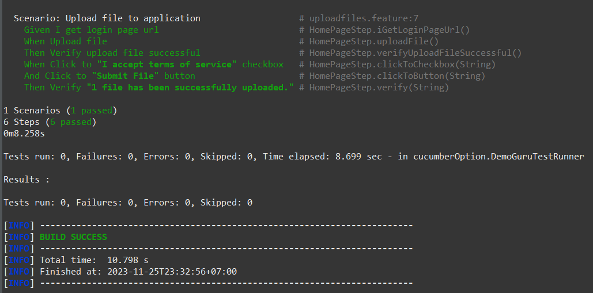

# Demo Guru99 - Demo Project
Make sure your PC has installed these:
* Eclipse/IntelliJ tools for run source code
* Apache Maven 3.6.3 (cecedd343002696d0abb50b32b541b8a6ba2883f)
* Java version: 11.0.18, vendor: Oracle Corporation, runtime: *\jdk-11
* Maven home & Java home (environment variable)
* Tidy Gherkin extension (support write BDD style)
* Pretty Gherkin extension (View Feature file)
* Cucumber Plugin (Eclipse) / Cucumber for Java (IntelliJ)
* Natural 0.7.6 (Eclipse) -> Cucumber editor
## Clone source code
1. Link public repository: https://github.com/dinhtanwb/demoguru99-test
2. Use cmd to clone source code any where which you want
3. Open & import this to Eclipse / IntelliJ
## How to run this?
### Run by user interface
1. Right click to root folder -> Run as

  

2. Select to Maven clean and check console

  

3. Select to Maven test and check console

  

Note: This way can't export cucumber reporter
### Run by commmand line
1. Directly to your root folder through out terminal
2. Use "mvn clean test -DBROWSER=chrome verify" to run and export report

  

3. After complete you can check report at: root.folder/target/site/cucumber-reporting/cucumber-html-reports/overview-features.html

  

  

